# VM Setup NCAE Cyber Games - 2026


This document explains, step-by-step, how to install and configure the Linux virtual machines (Ubuntu and Rocky) in VirtualBox for future labs.


---


## ISO Operating System Download


### 1. Download Ubuntu ISO

```bash

https://ubuntu.com/download/desktop/thank-you?version=24.04.3&architecture=amd64&lts=true

```

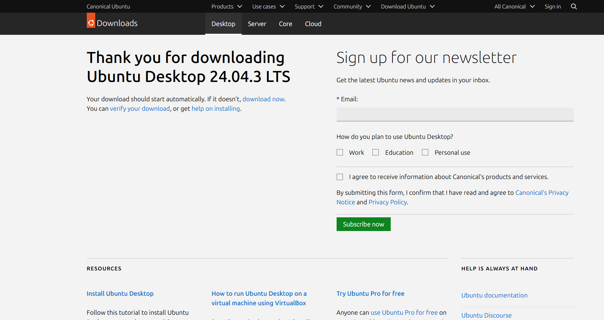


### 2. Download Rocky 8 ISO

```bash

https://download.rockylinux.org/pub/rocky/8/isos/x86_64/Rocky-8.10-x86_64-boot.iso

```


---


## VirtualBox Installation


### 1. Install VirtualBox from:

```bash

https://www.virtualbox.org/wiki/Downloads

```

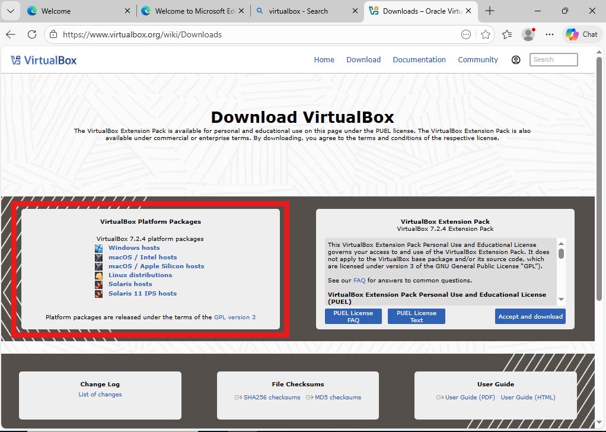


### 2. Install the binary (use default installation path)


### 3. Open VirtualBox → Select **New**


### 4. Configure the Virtual Machine

If a field is **not** listed, leave the default value.


#### Name and Operating System

- **Name:** `NCAE-RockyVM`

- **ISO Image:** Select your downloaded Ubuntu or Rocky ISO


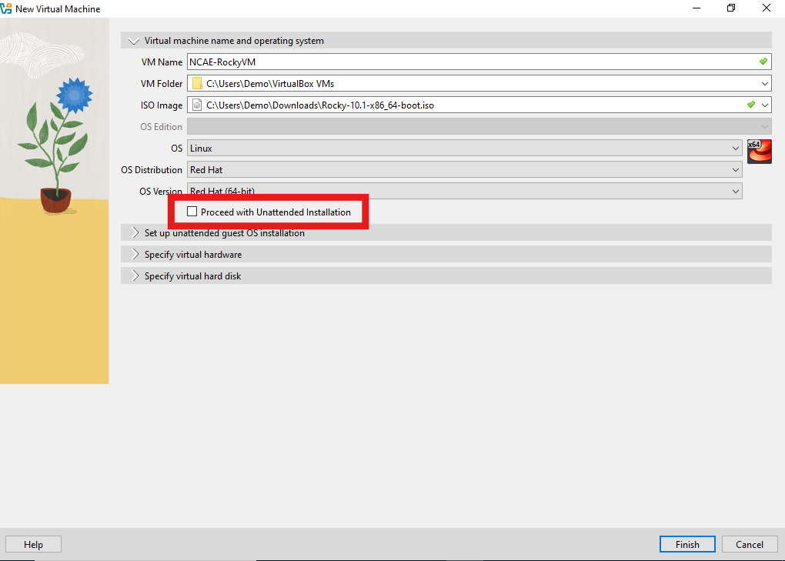


Skip unattended installation:

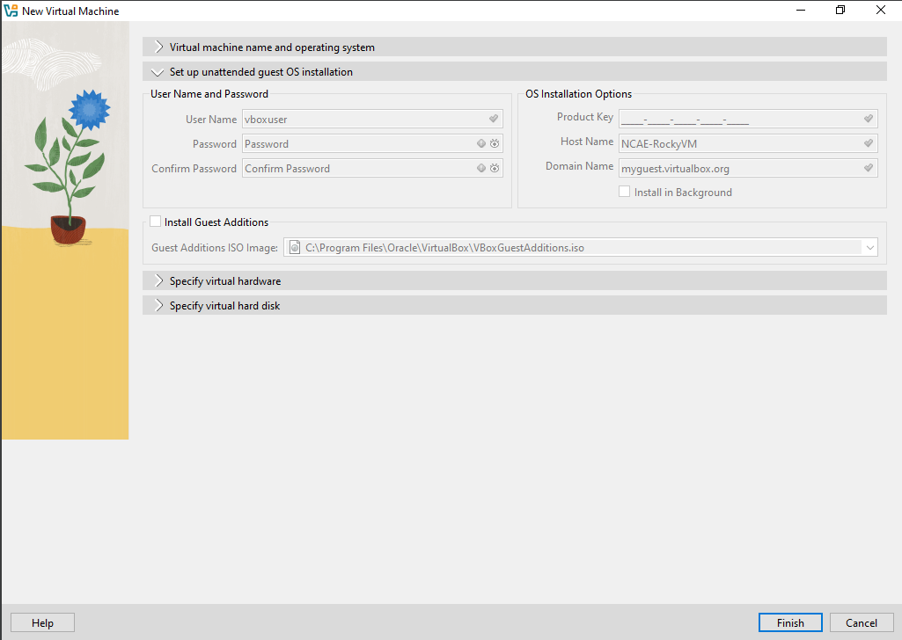


#### Hardware

- Base Memory: **4096 MB**

- Processors: **2**


#### Hard Disk

- Disk Size: Minimum **20GB**, recommended **50GB**


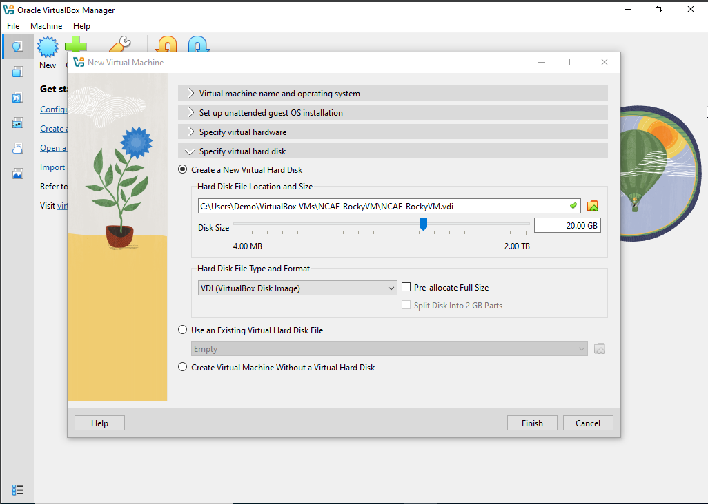


After completing configuration, select **Finish**.


---


## VM Setup


### 1. Start the VM


### 2. At the GRUB prompt, choose **Install [OS]**


### 3. Follow the installation steps


#### Language Selection

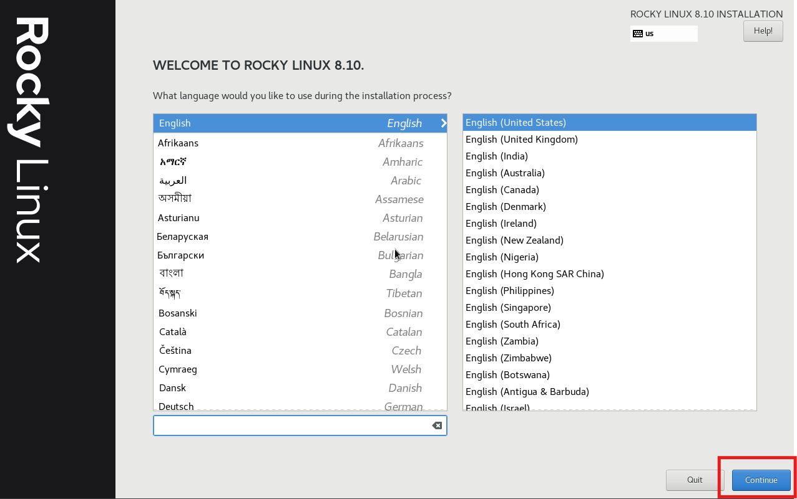


---


## Installation Summary


### Root Account Setup


- **Root Password:** `NCAELAB`


### Create User

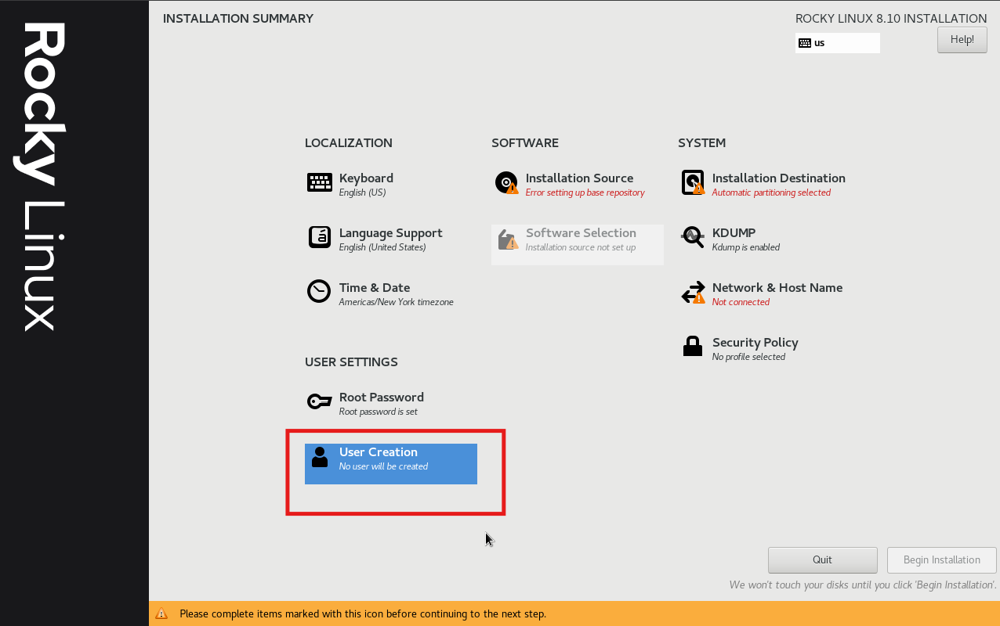


- Full Name: `NCAE Lab2026`

- Username: `nlab2026`

- Password: `NCAE`

- Make this user administrator: Checked


### Installation Destination

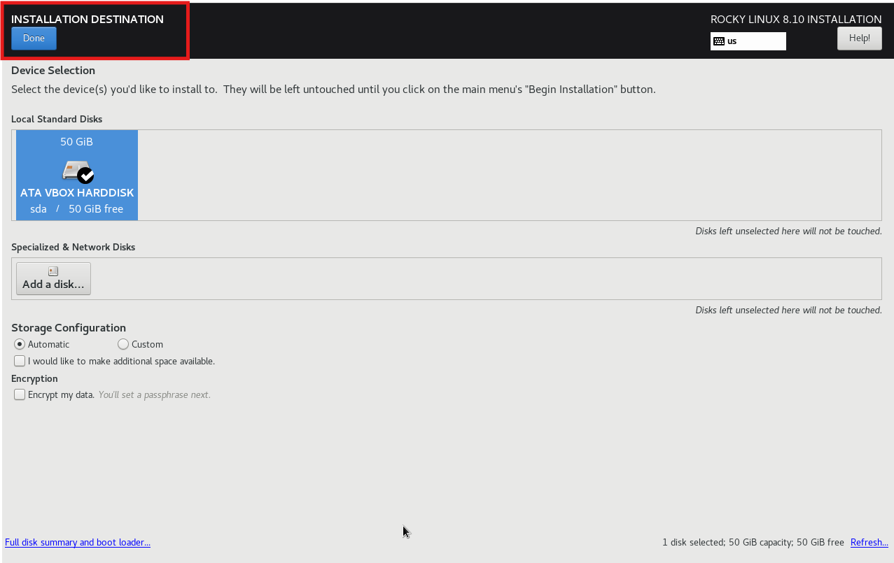


### Network & Hostname


Set hostname: **yourname-NCAE**  

Enable network.

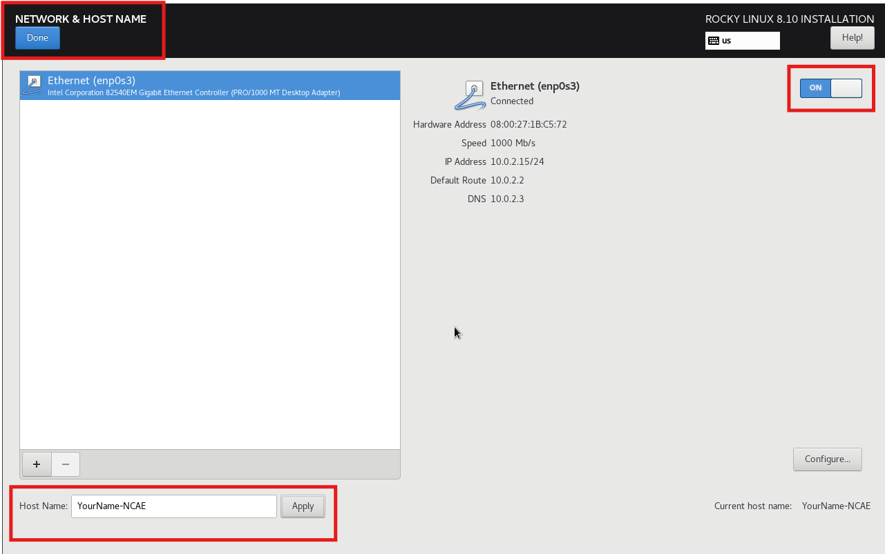


### Software Selection


### Begin OS Install


---


## VM Guest Utils Installation


This enables clipboard sharing, drag-and-drop, and better VM integration.


### 1. Insert Guest Additions ISO


### 2. Open Terminal


### 3. Install Required Dependencies


**Ubuntu:**

```bash

sudo apt update

sudo apt install -y bzip2 build-essential dkms linux-headers-$(uname -r)

sudo ./VBoxLinuxAdditions.run

reboot

```


**Rocky:**

```bash

sudo dnf update -y

sudo dnf install -y kernel-devel-$(uname -r) kernel-headers-$(uname -r)

```


```bash

sudo ./VBoxLinuxAdditions.run

```

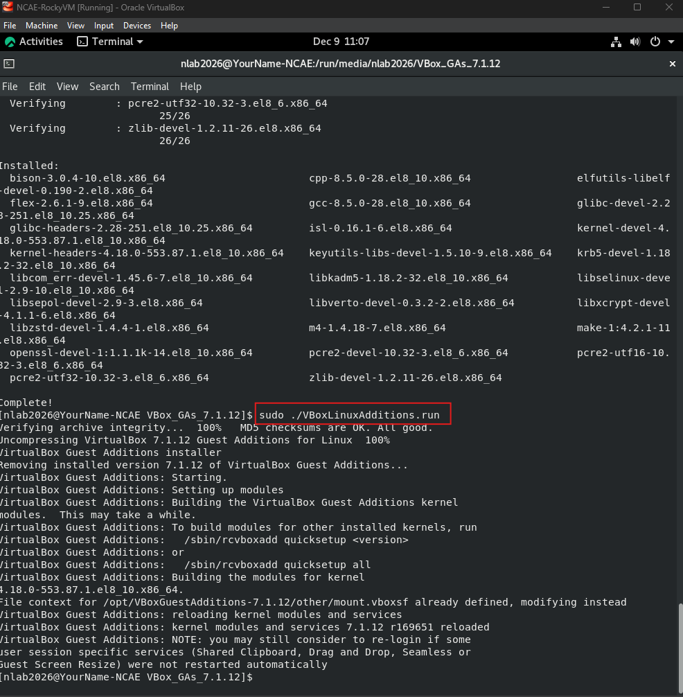


### 4. Enable Shared Clipboard

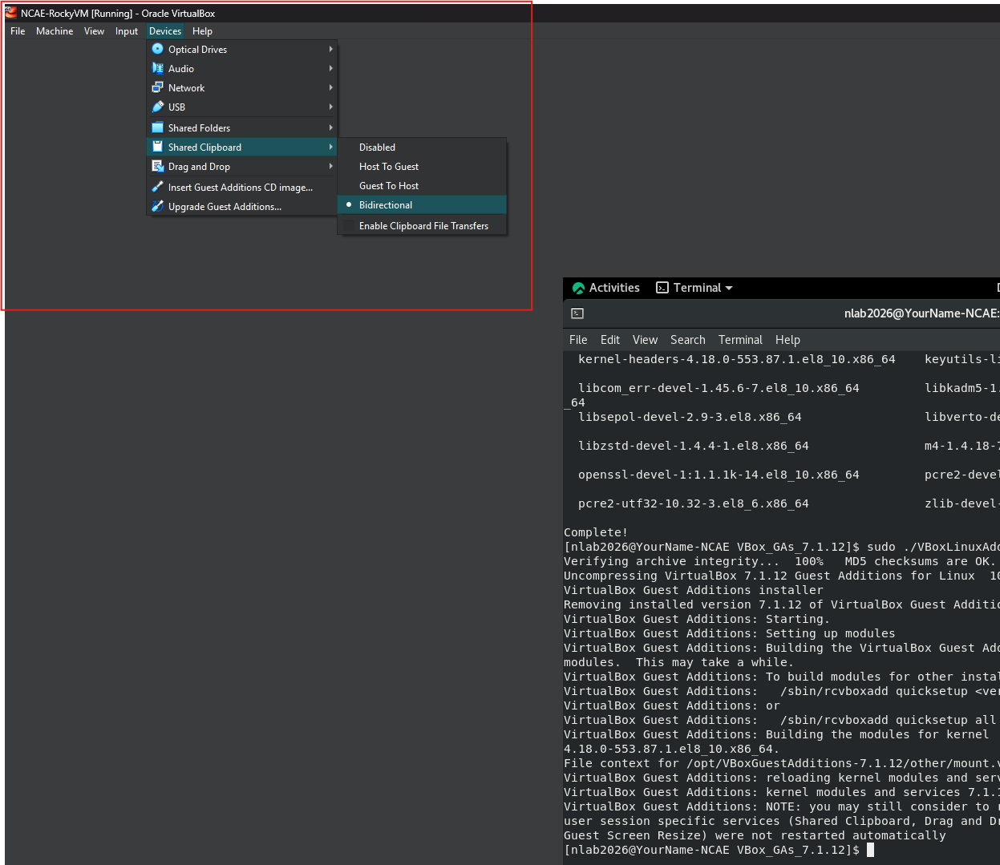


### 5. Add Shared Folder


### 6. Configure Network Adapter

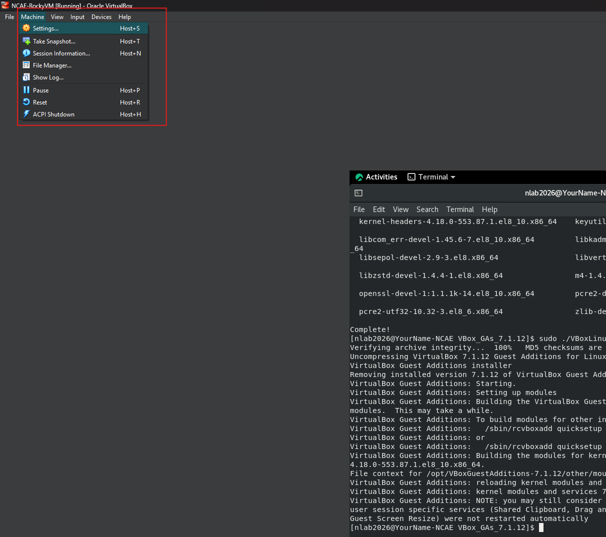


### 7. Reboot VM

```bash

reboot

```


### 8. Take a Snapshot

Go to Machine -> Take Snapshot

Snapshot Name: `[OS]_Baseline`

Description: This is the NCAE VM Lab Baseline
