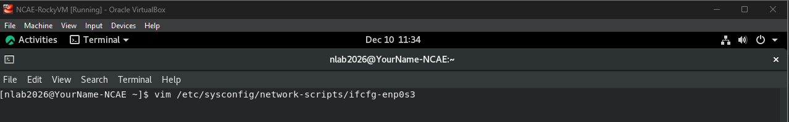
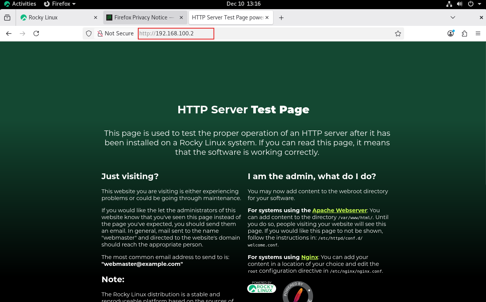
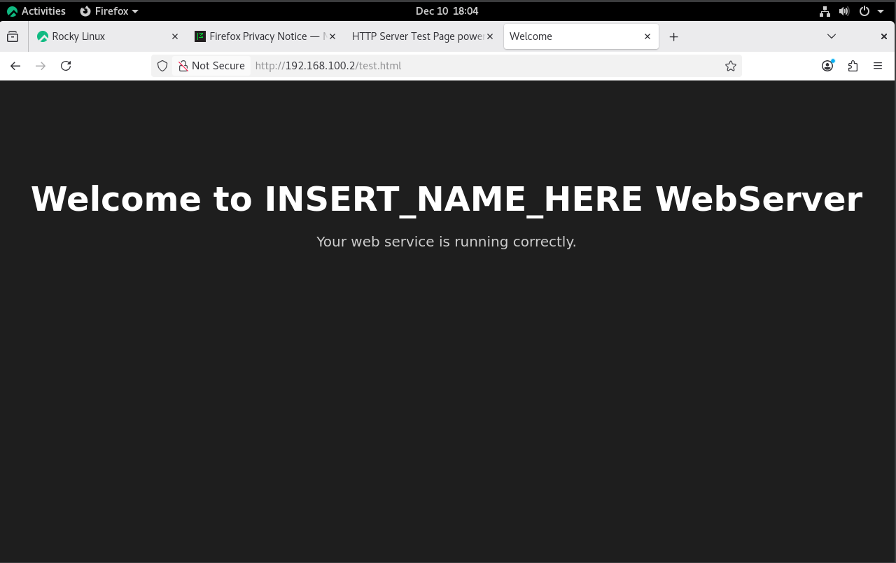
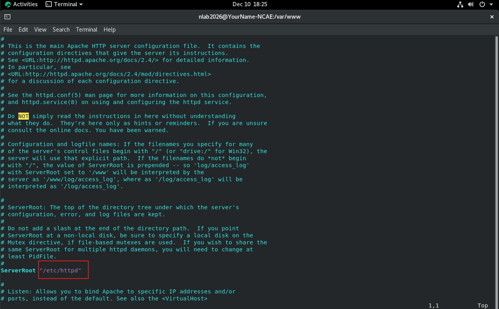
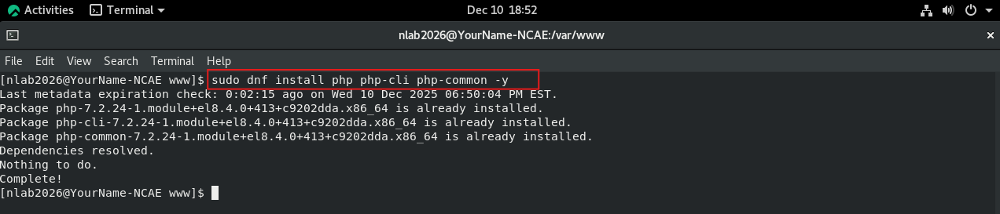

# Week 1 Summary

In order for a host to join a network it needs the following configured on it's networking interface (ethernet or wireless):

- IP Address
- Subnet Mask
- Default Gateway (Router Configuration)
- DNS(not required for routing but for other services)

---

## Configure Networking on Rocky Machine

Below is information on configuring host device for Networking:

---

### 1. Identify the Networking Interface

```bash
ip a
```


The ip a command will list all of the available interfaces on the machine. 

---

### 2. Find the Interface Configuration File

```bash
sudo nmcli -f NAME,DEVICE,FILENAME connection show
```


Then using the text editor of your choice, you can open and inspect the configuration file to see how the system is viewing the interface.




#### Details:
DEVICE - That is the name of the interface, your network adapter.  
ONBOOT - This parameter determines whether the adapter will persist after a shutdown.  
IPADDR - The IPV4 address of your host machine  
DNS1 - The primary DNS server (if DNS2, thats a secondary server)  
GATEWAY - Refers to the router's location, default gateway  

NOTE: This file may look different depending on which OS version. In general, the data remains the same but the formatting may look different.

---

### 3. Configure Interface Using nmcli

```bash
sudo nmcli connection modify "interface_name" ipv4.addresses "192.168.100.2/24"
```
```bash
sudo nmcli connection modify "interface_name" ipv4.gateway "192.168.100.1"
```
```bash
sudo nmcli connection modify " interface_name" ipv4.dns "192.168.100.1"
```
```bash
sudo nmcli connection modify "interface_name" ipv4.method manual
```


#### Details:
nmcli - network manager commandline interface, a tool used to control the NetworkManager service. Check out ```bash man nmcli``` for more details  
connection - all the network configuration for a network adpater are stored and referenced using the **connection** keyword/flag.  
modify - the specific property of the adapter we want to change from the connection  
interface_name - the name of the adapter/interface you want to configure/apply  
ipv4.addresses - the specific ip address/addresses you want your host machine to utilize. The /24 refers to the subnet mask that identifies the network.  
ipv4.gateway - the IP address of the router for the network. Also called a **default gateway**  
ipv4.dns - this is the DNS server IP address, this is what allows the computer to resolve hostnames to IP address (more on this later)  
ipv4.method - configures how the IP Address will be configured (manually or automtically)

---

### 4. Restart the Interface

```bash
nmcli connection down interface_name
```
```bash
nmcli connection up interface_name
```


down - turns off the interface  
up - turns the interface on  

---

### 5. Ping the Router

```bash
ping -c 4 192.168.100.1
```


ping sends what is called an icmp packet to the ip address enter. Think of this packet like a beaconing request, to see if something exists at that host.

---

## Configure Networking on Ubuntu Machine

This section will be added after Students experiment with configuring the Ubuntu instance on their own

---

# Starting Web Service on Rocky Machine

Below is information on configuring host device for Networking:

---

### 1. Install Apache Web Server

```bash
sudo dnf install httpd -y
```

*Note: the -y option just makes it so you don't have to enter YES, when installing a package*


---

### 2. Check Service Status


systemctl - this is the command line interface tool for the Linux System and service manager. The process it interacts with is called systemd.

status - queries the status of the requested service (httpd, ftp, ssh, etc.)  
restart - stops and starts the service from its current position (restart sometimes does not reload all aspects of a service )  
start - activates the systemd service  
stop - deactivates the systemd service  
enable - the service starts at boot (when the machine turns on the service turns on)  
disable - the service does not start at boot  

---

### 3. Start the Service


---

### 4. Open Firefox and Browse to Your IP




---

# Configuring Web Service on Rocky Machine

Below outlines the information to configure the web service on Rocky, including:

- The Web Content  
- The Web Configuration File  
- The Port Number  

---

## The Web Content

The Web Content is the websites/web pages that you visit when using your browser like Google Chrome, Safari, or Microsoft Edge. 
Web Content is generated typically using a combination of different programming languages such as HTML, CSS, Javascript, PHP, and so many other languages. To change,
the content view you simply need to add or update the existing code in the web root.

Web Root / Document Root - it is the location on the machine where the web service can access, present, and store its web files. Typically, the default page is the index.html
file, however, you can change this file and or assign a different file to be the home page.

On Rocky, the Web Root is located at ```/var/www/html```, anything that inherits permissions from this directory will be accessible by the web service. Add a file called test.html and add the following code:

```bash
vim /var/www/html/test.html
```

**test.html**
```bash
<!DOCTYPE html>
<html lang="en">
<head>
    <meta charset="UTF-8">
    <title>Welcome</title>
    <style>
        body {
            background-color: #1e1e1e;
            color: #ffffff;
            font-family: Arial, sans-serif;
            text-align: center;
            padding-top: 100px;
        }
        h1 {
            font-size: 48px;
            margin-bottom: 10px;
        }
        p {
            font-size: 20px;
            color: #cccccc;
        }
    </style>
</head>
<body>
    <h1>Welcome to INSERT_NAME_HERE WebServer</h1>
    <p>Your web service is running correctly.</p>
</body>
</html>
```

Then browse to the web page using your browser  


Note: On Rocky, there is not a default index.html file installed by default, instead there is an alias file that gets used in the event there is no web content.
You can see this file at /usr/share/httpd/noindex/index.html

---

## Web Configuration File

The Web Configuration File is the file that tells the service how to configure itself. This is not an exhaustive list of every parameter, but some things to note:

Listen - Controls which port the server listens on. By default, most webservices run on port 80 or 443  
ServerRoot - other configuration files associated with webservice. This is where the webservice resides  
DocumentRoot - the location where the website files are stored  



Note: As of now, you do not need to change anything in this file to get the webservice working. However, in later weeks we will modify certain aspects of the file to improve security.

---

# Starting Web Service on Ubuntu Machine

This section will be added after Students experiment with configuring the Ubuntu instance on their own

---

# Introduction to a Vulnerability

The specifics of hardening and vulnerabilities will be covered in detail in a later week. However, it's important to see what a default vulnerability looks like if a service is not properly secured. For this lab section, you will need the following:

- wireshark installed
- php installed in your virtual environment
- insecure login template file
- allow firewall traffic

---

## 1. Install Wireshark

```bash
sudo dnf install wireshark -y
```


---

## 2. Install PHP

```bash
sudo dnf install php php-cli php-common -y
sudo systemctl restart httpd
```



Note: You need to restart the webservice for PHP to be applied and used by your webservice

---

## 3. Insecure PHP Form

```bash
sudo vim /var/www/html/login.php
```

**login.php**
```bash
<!DOCTYPE html>
<html>
<head>
    <title>Insecure Login</title>
    <style>
        body { background: #111; color: #fff; font-family: Arial; text-align: center; padding-top: 100px; }
        input { padding: 12px; width: 260px; margin: 8px; border-radius: 5px; border: none; }
        button { padding: 12px 25px; margin-top: 10px; cursor: pointer; border: none; border-radius: 5px; }
        .warning { color: #ff4444; font-weight: bold; margin-bottom: 20px; }
        form { background: #222; display: inline-block; padding: 30px; border-radius: 10px; }
    </style>
</head>
<body>

<h1>Insecure Login Demo</h1>
<p class="warning">This page uses HTTP — any password typed here is sent in plaintext.</p>

<form method="POST" action="process.php">
    <input type="text" name="username" placeholder="Enter Username" required><br>
    <input type="password" name="password" placeholder="Enter Password" required><br>
    <button type="submit">Log In</button>
</form>

</body>
</html>
```

---

## 4. Allow Web Traffic in Firewall

```bash
sudo firewall-cmd --zone=public --add-port=80/tcp --permanent
sudo firewall-cmd --reload
```


---

## 5. Observing the Vulnerability

### a. Start Wireshark

Select **Loopback: lo**


### b. Open the insecure login page in Firefox


NOTE: If typing the IP Address is not showing the data, change the interface to Loopback: lo
