# Week 3 Summary

---

## Prerequisites

- Mikrotik Router ISO Installed in a VM
- Rocky or Ubuntu ISO Installed in a VM with a web service installed
- Rocky or Ubuntu ISO Installed in a VM (DNS Server)
- Three Virtual Network Adapters (2 virtual networks total)
  - LAN
  - WAN

**Note:** Please review `Week2.md` if you are unsure how to configure the router or host networking.

`t = team number`

---

## DNS Install

**Note:** The IP address values and topology may change depending on the environment.  
The image below showcases the network configuration for the example machine.

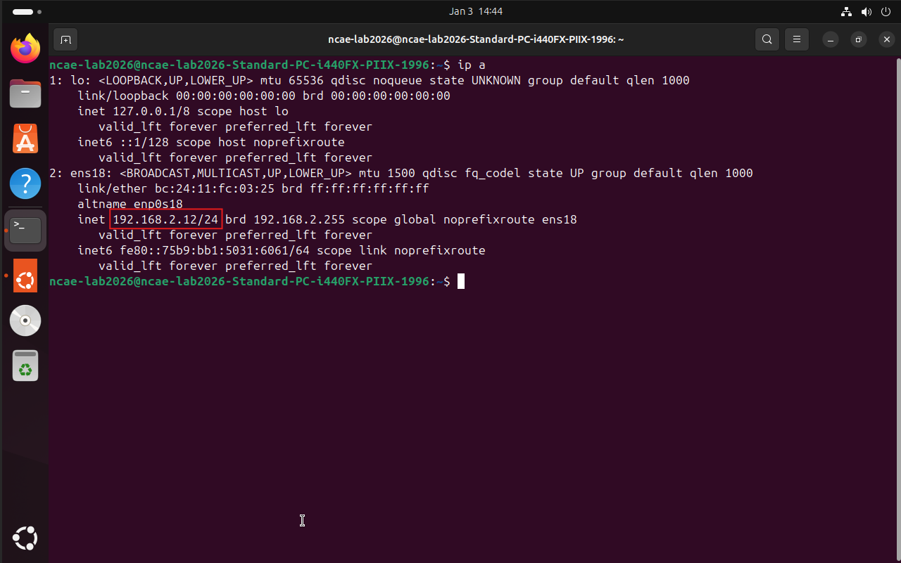

---

### 1. Install BIND9

If not installed already, install bind9:
```bash
sudo apt update && sudo apt install bind9 -y
```
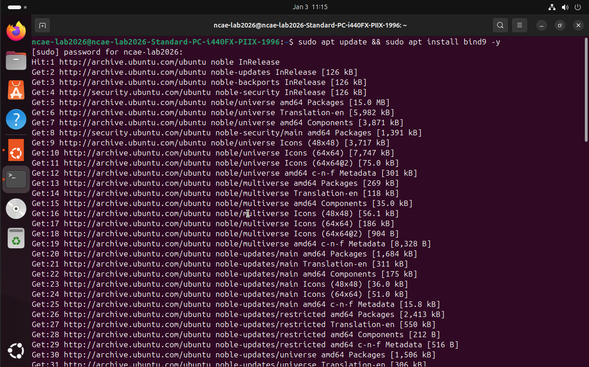

---

### 2. Review DNS Configuration Directory

The service configuration files are stored in:
```text
/etc/bind
```
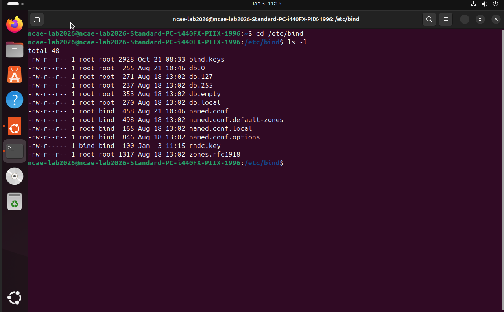

---

### DNS Concepts (Quick Reference)

DNS uses **zones** to map specific namespaces (domains) to IP addresses and vice versa.

For the scope of the competition, there are two types of queries a host can make:

- **Forward lookup**  
  The host is asking: *What is the IP address of a domain?*  
  Example: `google.com → 8.8.8.8`

- **Reverse lookup**  
  The host is asking: *What is the domain name of an IP address?*  
  Example: `8.8.8.8 → google.com`

To map this information, DNS uses **records**.

For this competition, you only need to concern yourself with:

- **A Record** – IPv4 address mapping to a domain name  
- **PTR Record** – IPv4 address mapping back to a domain  

**NOTE:** When you see `→`, think *resolve*.

---

## DNS Internal Configuration

---

### 3. Define DNS Zones

To configure the records for our DNS server, modify:
```text
/etc/bind/named.conf.default-zones
```
Add the following entries **to the bottom** of the file:

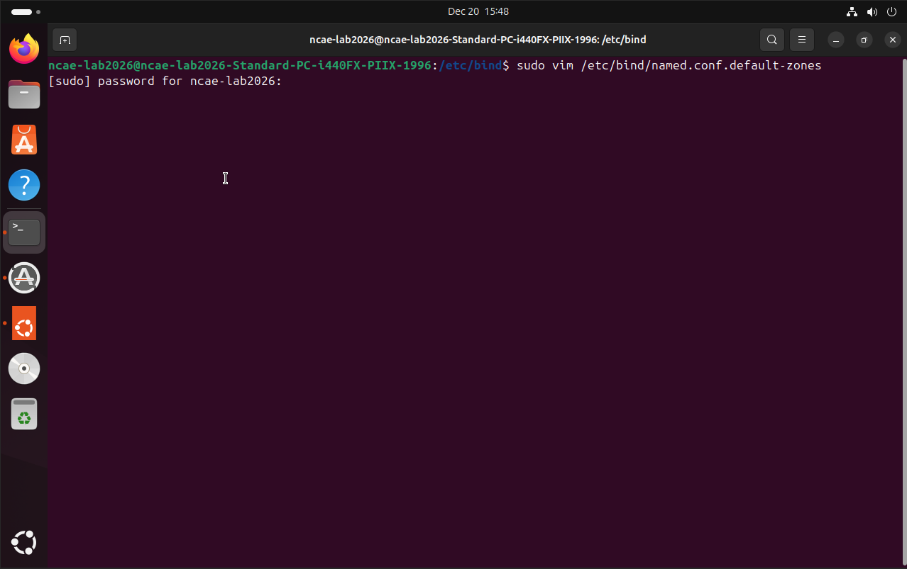
```text
zone "team<t>.org" IN {
	type master;
	file "/etc/bind/zones/forward.team<t>.org";
	allow-update { none; };
};
```
```text
zone "<t>.168.192.in-addr.arpa" IN {
	type master;
	file "/etc/bind/zones/reverse.team<t>.org";
	allow-update { none; };
};
```
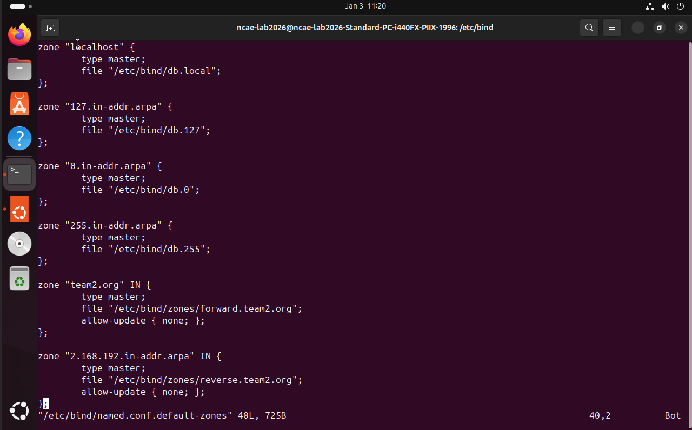

---

### 4. Create Zone Files

Create the directory for zone files:
```bash
sudo mkdir /etc/bind/zones
```
Linux provides a template file called `db.empty`. We will copy it instead of creating files manually.

Create the forward lookup file:
```bash
sudo cp /etc/bind/db.empty /etc/bind/zones/forward.team<t>.org
```
Create the reverse lookup file:
```bash
sudo cp /etc/bind/db.empty /etc/bind/zones/reverse.team<t>.org
```
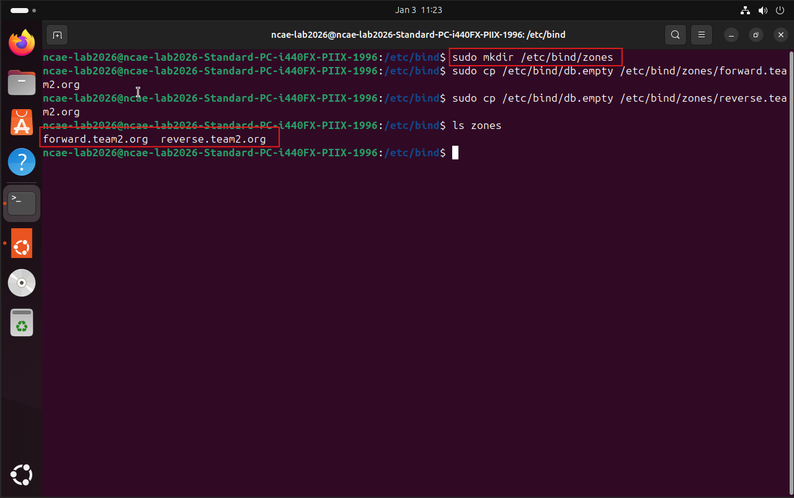

---

### 5. Set Hostname

Change the system hostname to something easier to remember:
```bash
sudo hostnamectl set-hostname ncae-lab2026
```
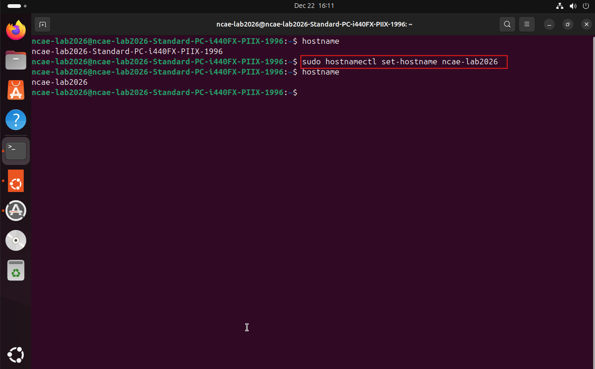
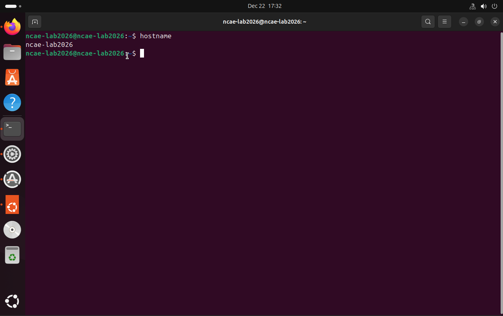

---

### 6. Configure Forward Lookup Zone (A Record)

Open `forward.team<t>.org` and make the following changes:
```bash
sudo nano /etc/bind/zones/forward.team<t>.org
```
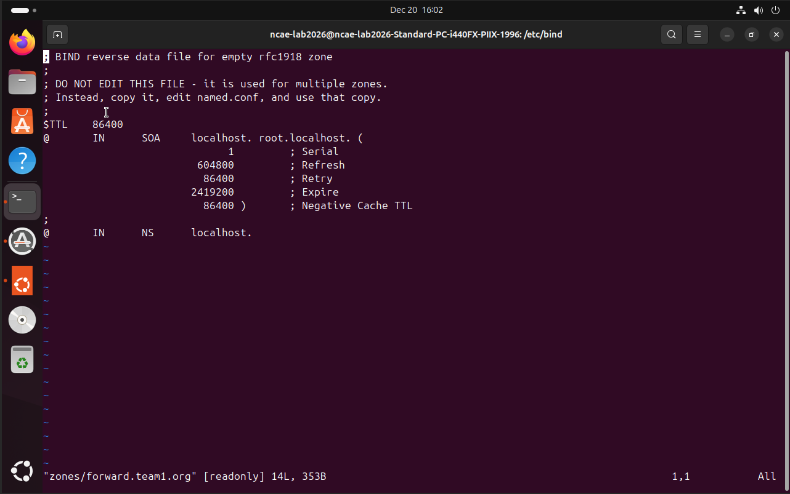
```text
$TTL    86400
@       IN      SOA     ncae-lab2026.team<t>.org root.ncae-lab2026. (
                        2       ; Serial
                        604800  ; Refresh
                        86400   ; Retry
                        2419200 ; Expire
                        86400 ) ; Negative Cache TTL
;
@       IN      NS      ncae-lab2026
ncae-lab2026    IN      A   192.168.<t>.12
www            	   IN     A    192.168.<t>.5
```
Add the following records:
```text
ncae-lab2026    IN A    192.168.t.12  
www             IN A    192.168.t.5
```
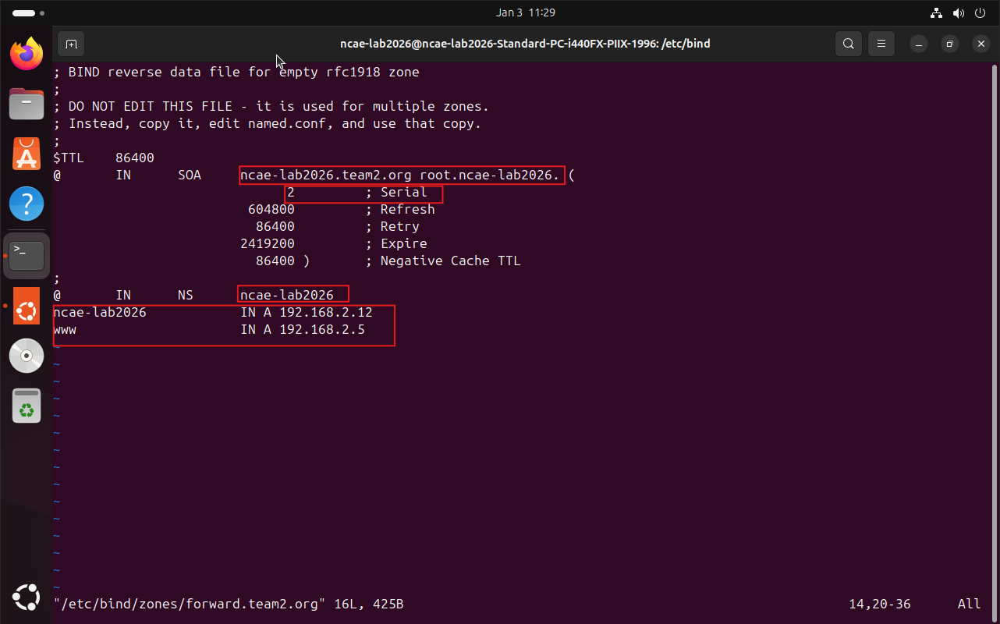

Mimic the image above if you get stuck.

---

### 7. Configure Reverse Lookup Zone (PTR Record)

Open `reverse.team<t>.org`:
```bash
sudo nano /etc/bind/zones/reverse.team<t>.org
```
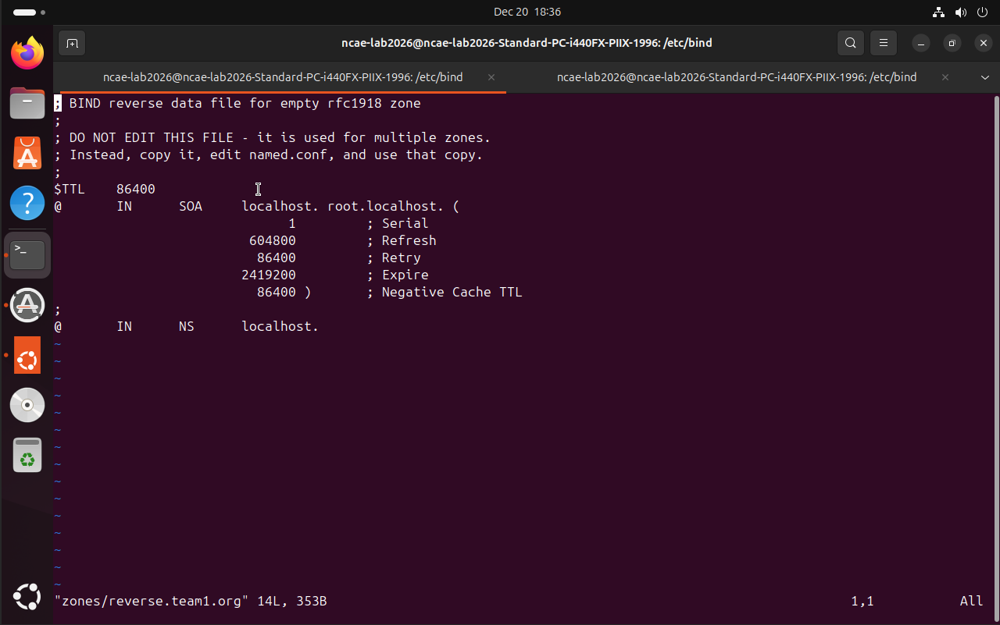
```text
$TTL    86400
@       IN      SOA     ncae-lab2026.team<t>.org. root.team<t>.org. (
                        2       ; Serial
                        604800  ; Refresh
                        86400   ; Retry
                        2419200 ; Expire
                        86400 ) ; Negative Cache TTL
;
@       IN      NS      ncae-lab2026.
5       IN      PTR     www.team<t>.org

```

Add the following record:
```text
5   IN  PTR ncae-lab2026.team<t>.org
```
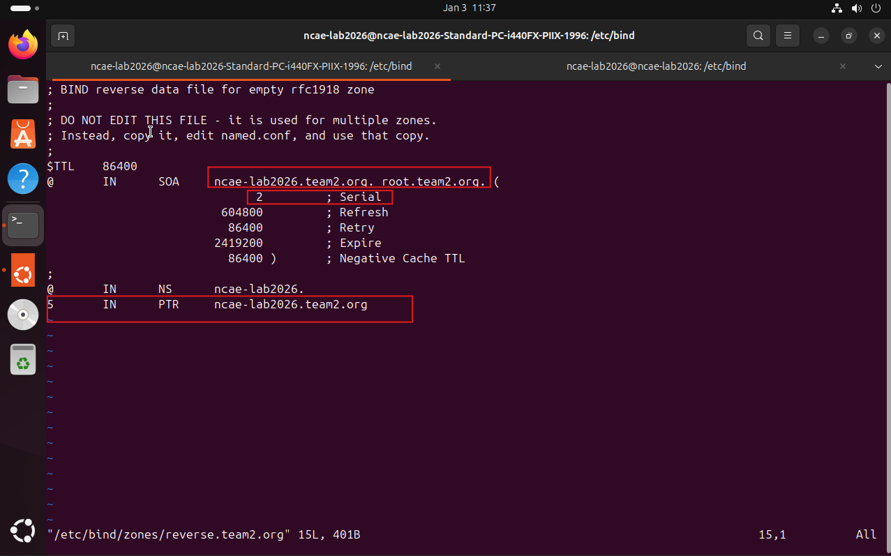

Mimic the image above if you get stuck.

---

### 8. Reload and Restart DNS Service

Reload and restart the DNS service to apply changes.

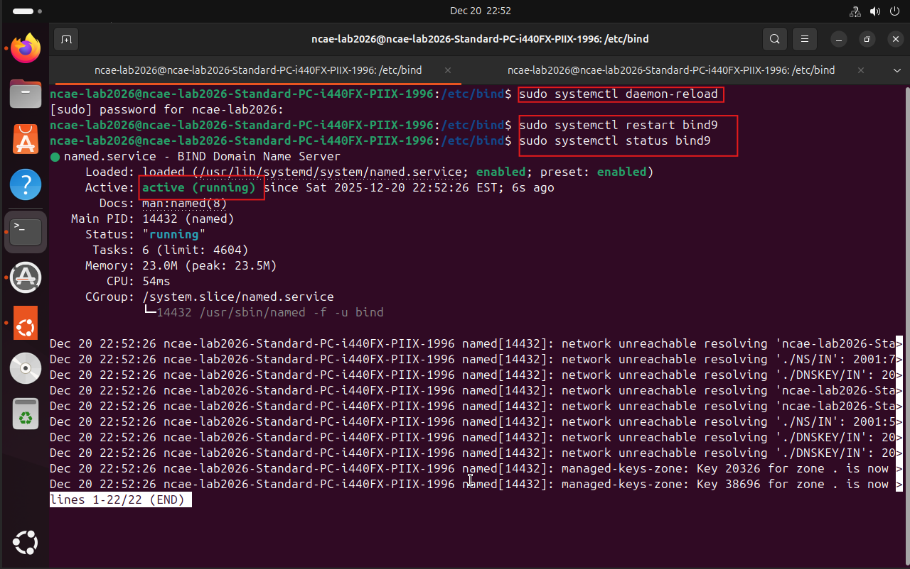

---

### 9. Test Internal DNS Resolution

On another internal machine, set the DNS server and test name resolution:
```bash
nmcli connection modify "Wired Connection 1" ipv4.dns "192.168.t.12"

nslookup 192.168.t.5
```
---

## DNS External Configuration

---

### 10. Configure Port Forwarding for DNS (WAN → LAN)

To allow external devices to use the internal DNS server, configure a DST-NAT rule.

Navigation path:

Go to **Advanced** → **IP** → **Firewall** → **NAT** → **New**


General Tab:
```text
- Chain: dstnat
- Protocol: udp
- Dst. Port: 53
- In. Interface: WAN
```
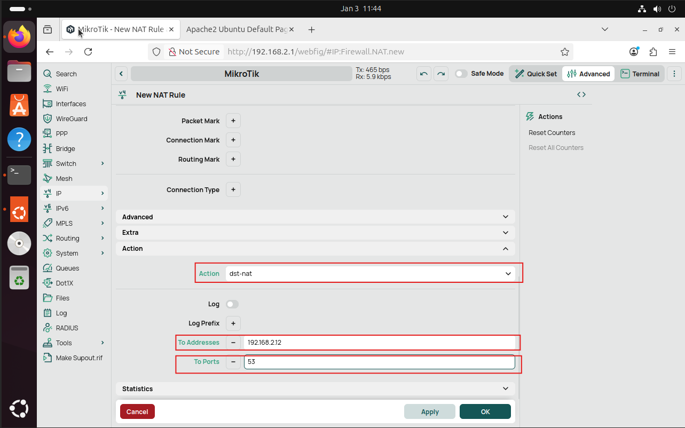

Action Tab:
```text
- Action: dst-nat
- To Addresses: 192.168.t.12
- To Ports: 53
```
---

### 11. Add Firewall Filter Rule

Allow DNS traffic to exit the LAN:

Navigation path:

Go to **Advanced** → **IP** → **Firewall** → **Filter Rules** → **New**

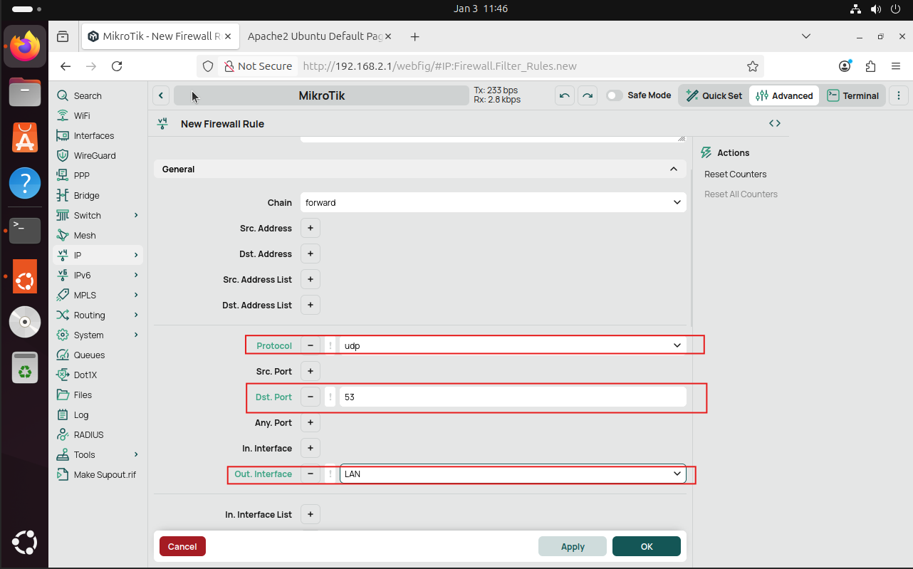

General Tab:
```text
- Protocol: udp
- Dst. Port: 53
- Out. Interface: LAN
```


Action Tab:
```text
- Action: accept
```
---

### 12. Add External DNS Records

External clients do not see private IP addresses.

Add an external-facing A record to handle WAN-based queries.

```bash
sudo cp /etc/bind/db.empty /etc/bind/zones/forward.team<t>.cnyhackathon.org
```

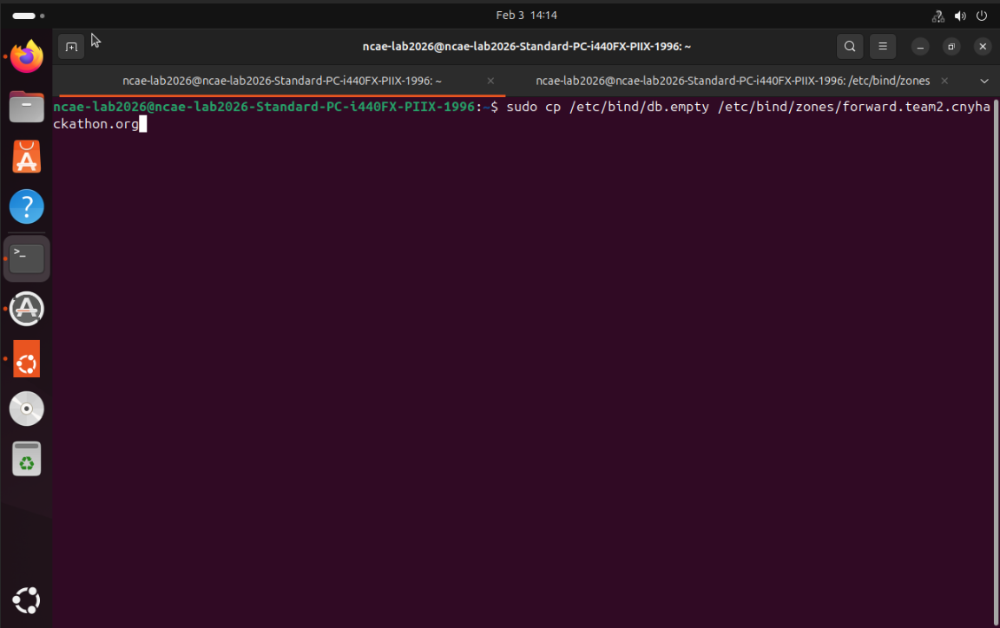
```text
/etc/bind/zones/forward.team<t>.cnyhackathon.org
```
Ensure your entry in forward.team<t>.cnyhackathon.org looks like this:

NOTE: Change <t> to your team number as shown in the image below:
```text
$TTL    86400
@       IN      SOA     ns1.team<t>.cnyhackathon.org root.ns1. (
                        2       ; Serial
                        604800  ; Refresh
                        86400   ; Retry
                        2419200 ; Expire
                        86400 ) ; Negative Cache TTL
;
@       IN      NS      ns1
ns1     IN      A       172.18.13.<t>
www     IN      A       172.18.13.<t>
```


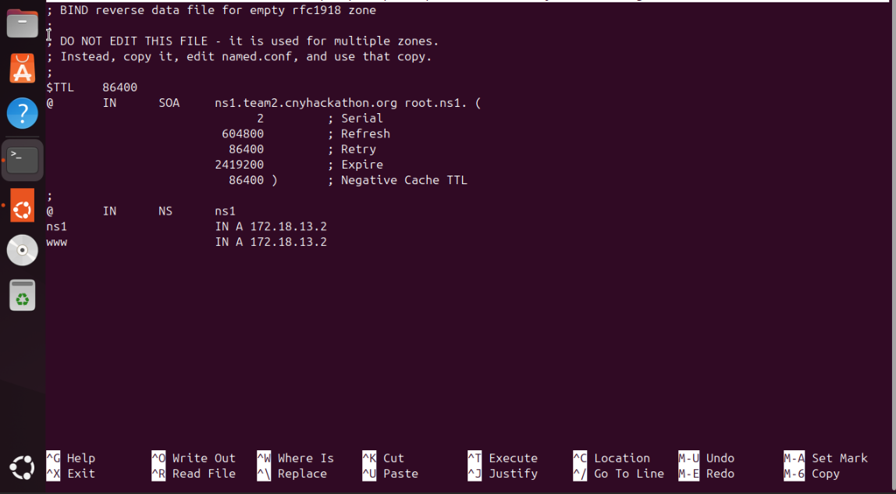

---

Add an external-facing PTR record to handle WAN-based queries.

```bash
sudo cp /etc/bind/db.empty /etc/bind/zones/web.team<t>.cnyhackathon.org
```
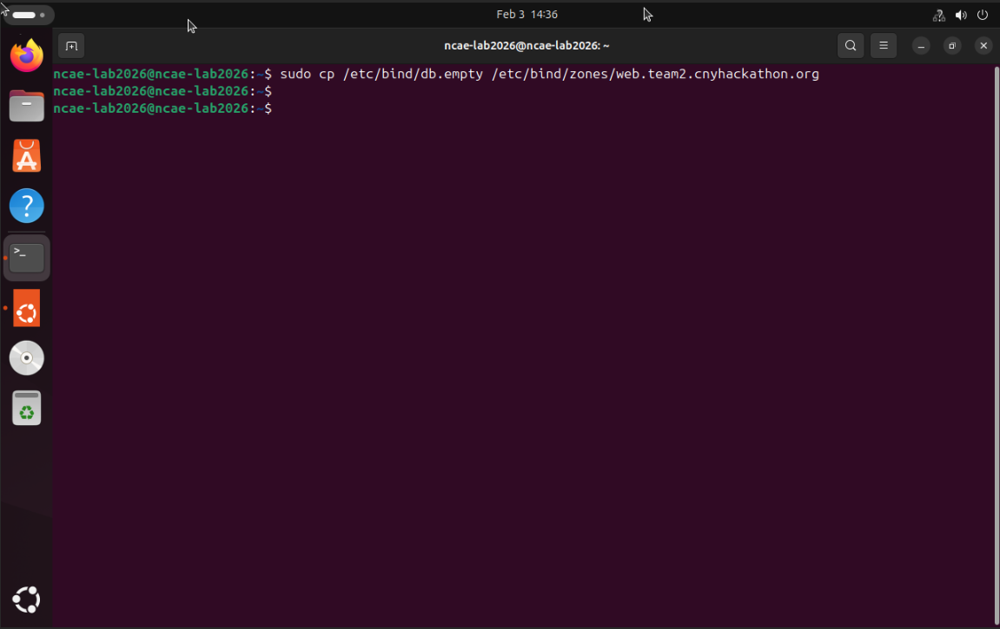
```text
/etc/bind/zones/web.team<t>.cnyhackathon.org
```
Ensure your entry in web.team<t>.cnyhackathon.org looks like this:
```text
$TTL    86400
@       IN      SOA     ns1.team<t>.cnyhackathon.org. root.cnyhackathon.org. (
                        2       ; Serial
                        604800  ; Refresh
                        86400   ; Retry
                        2419200 ; Expire
                        86400 ) ; Negative Cache TTL
;
@       IN      NS      ns1.
2       IN      PTR     ns1.team<t>.cnyhackathon.org
2       IN      PTR     www.team<t>.cnyhackathon.org
```

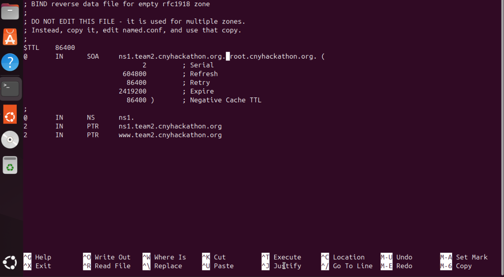

---

Add the zones files to the ```text /etc/bind/named.conf.default-zones```
```text
zone "team<t>.cnyhackathon.org" IN {
    type master;
    file "/etc/bind/zones/forward.team<t>.cnyhackathon.org";
    allow-update { none; };
};

zone "13.18.172.in-addr.arpa" IN {
    type master;
    file "/etc/bind/zones/web.team<t>.cnyhackathon.org";
    allow-update { none; };
};
```

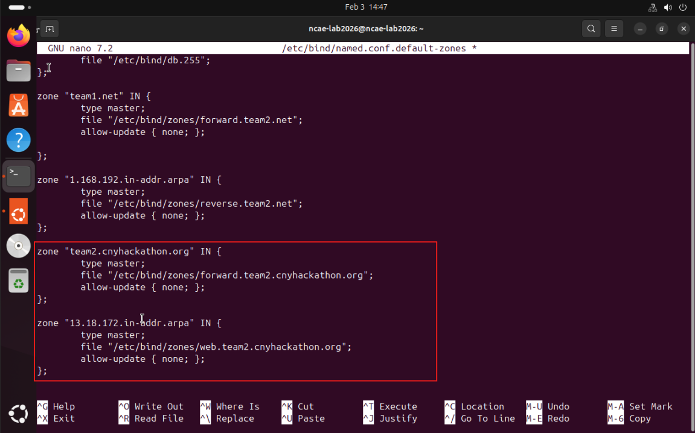

### 13. Restart DNS Service

Restart the bind9 service to apply all changes:
```bash
sudo systemctl restart bind9
```
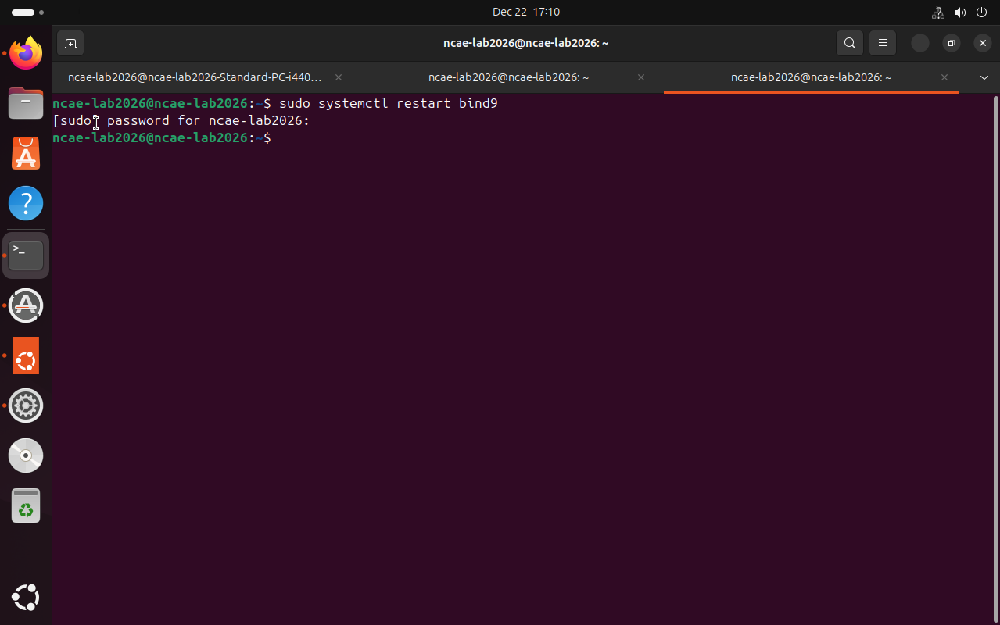

---

### 14. Test

From an external machine you can perform the following commands:
```bash
dig external.team<t>.org  
nslookup external.team<t>.org
```
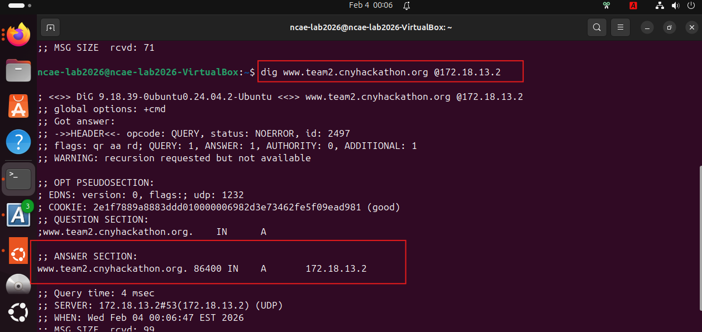
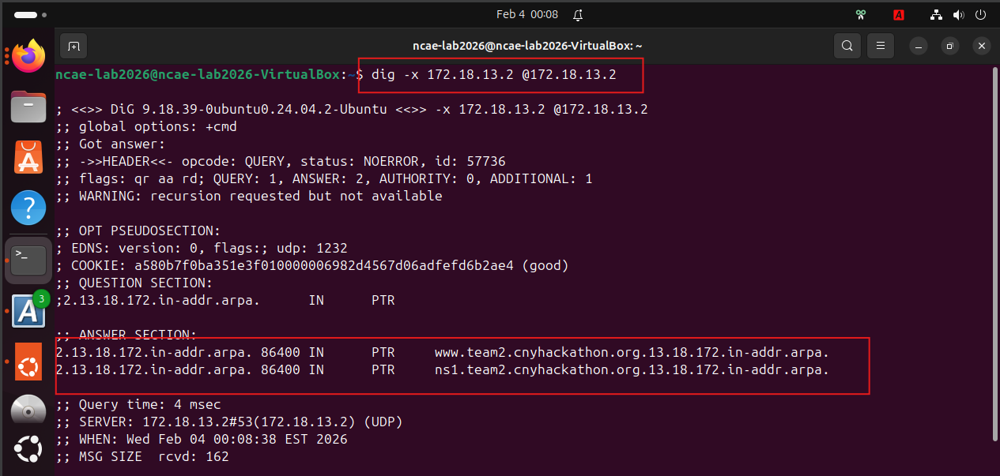
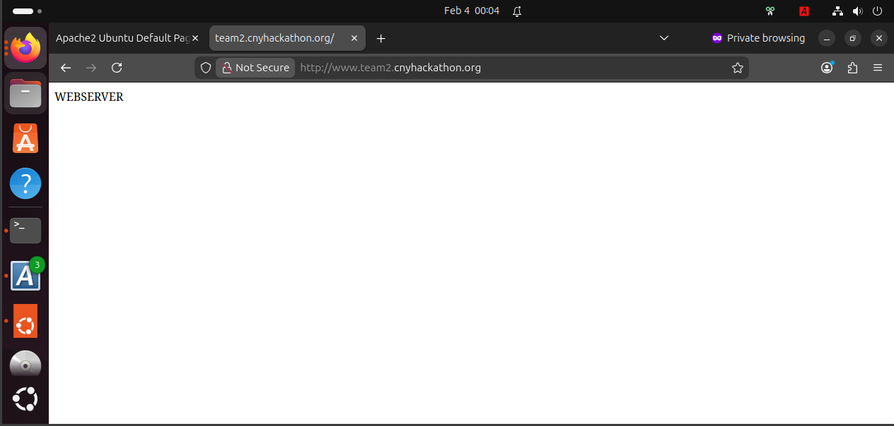
