# Week 6 Summary

---

## Prerequisites

- Mikrotik Router configured and routing correctly
- Web server installed and externally reachable
- DNS (internal + external) working
- PostgreSQL installed and accessible
- SMB share configured and accessible
- SSH key-based login working
- Control node operational (Ansible + Terraform)

All services should be scoring green before beginning this week.

`<t> = team number`  
Backup Server IP (ALL TEAMS): `192.168.<t>.15`

---

# Backup & Recovery

Up until now, we focused on building services.

This week focuses on keeping them alive.

In a competition environment, services will fail. Not always because of misconfiguration — but because someone removed something important.

Files may be:

- Deleted  
- Modified slightly  
- Corrupted  
- Overwritten  
- Replaced with incorrect content  

The service might still run.  
The port might still be open.  

But scoring can still fail.

This week teaches:

- What files actually matter  
- Where those files live  
- How to back them up  
- How to restore them  
- How to recover quickly under pressure  

If you cannot restore your system, you do not control your system.

Availability is a security pillar.

---

# Part 1 – Local Backup

We begin by protecting critical files locally.

---

## 1. Create Backup Directory - ALL MACHINES

```bash
sudo mkdir /backup
```

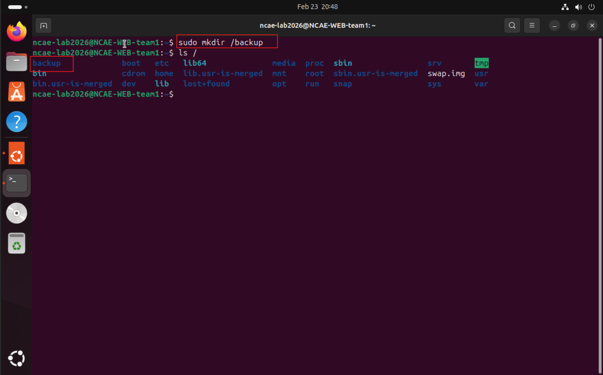

This directory will store known-good copies of required artifacts.

---

## 2. Backup Web Content - WEB SERVER

```bash
sudo cp /var/www/html/index.html /backup/index.html
```

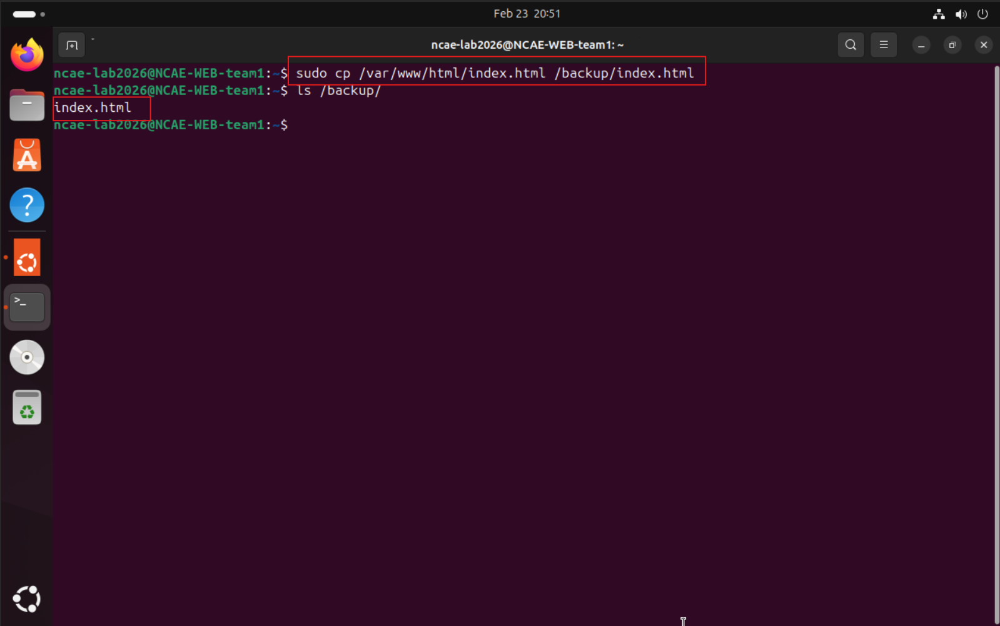

This protects the required competition string inside the page.

---

## 3. Backup DNS Configuration - DNS SERVER

```bash
sudo cp -r /etc/bind /backup/bind_backup
```

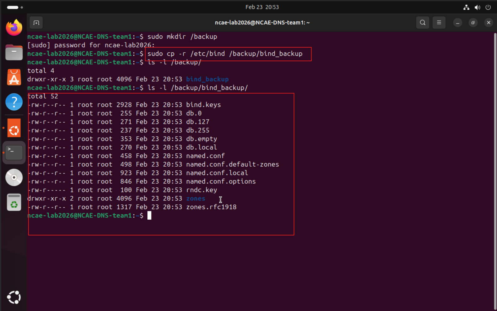

If zone files are deleted, scoring fails even if the service starts.

---

## 4. Backup PostgreSQL (Logical Dump) - DATABASE SERVER

```bash
sudo -u postgres pg_dump db | sudo tee /backup/db_backup.sql > /dev/null
```

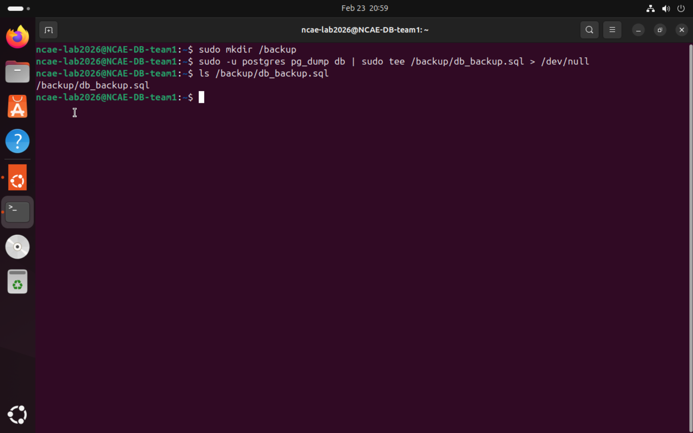

### What this command is doing:

- `sudo -u postgres` → Run as the postgres user  
- `pg_dump db` → Export the database named `db`  
- `tee` → Write output to a file while preserving permissions  
- `> /dev/null` → Suppress terminal output  

This creates a logical snapshot of the database.

---

## 5. Backup SMB Share - SMB SERVER

```bash
sudo cp -r /mnt/files /backup/smb_backup
```

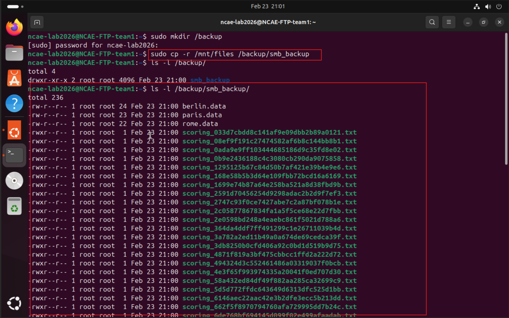

Required artifacts must always exist.

---

## 6. Backup SSH Authentication - ALL MACHINES

```bash
sudo mkdir -p /backup/ssh_backup
sudo find /home -type d -name ".ssh" -exec cp -r {} /backup/ssh_backup/ \;
```

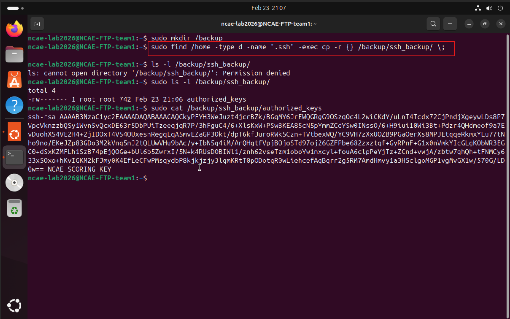

### What this command is doing:

- `find /home` → Search all user directories  
- `-type d` → Only directories  
- `-name ".ssh"` → Match directories named `.ssh`  
- `-exec cp -r {}` → Copy each result  
- `\;` → End command  

This copies every user's SSH configuration into backup.

If `authorized_keys` is deleted, SSH scoring fails.

---

# Files of Interest (Scoring Critical) - REFERENCE

Scoring checks more than uptime.

It checks:

- Specific files  
- Specific content  
- Specific authentication behavior  
- Specific artifacts  

If these are missing, scoring fails.

---

## Web

```
/var/www/html/index.html
/etc/httpd/conf/httpd.conf
/etc/httpd/conf.d/
/etc/ssl/certs/
/etc/ssl/private/
```

The file `/var/www/html/index.html` must contain:

```
NCAE-CYBERGAMES-TEAM<t>-WEBSITE
```

If that string is removed, scoring fails even though Apache runs.

---

## DNS

```
/etc/bind/named.conf
/etc/bind/named.conf.default-zones
/etc/bind/zones/*
```

Deleting zone files breaks forward and reverse resolution.

---

## PostgreSQL

```
/etc/postgresql/*/main/postgresql.conf
/etc/postgresql/*/main/pg_hba.conf
```

If pg_hba.conf is altered, authentication fails.

---

## SMB Required Artifacts

These files must exist:

```
berlin.data
rome.data
paris.data
amsterdam.data
data_dump_1.bin
data_dump_2.bin
data_dump_3.bin
```

If even one required file is deleted, SMB scoring fails.

---

## SSH

```
/home/*/.ssh/authorized_keys
/etc/ssh/sshd_config
/etc/ssh/ssh_host_*
```

If authorized_keys is removed, login fails.

---

# Part 2 – Centralized Remote Backup (Pull Model)

Local backups protect against small mistakes.

Remote centralized backups protect against system loss.

In this model:

- The backup server logs into each service machine  
- The backup server pulls critical files  
- Client machines never log into the backup server  

Backup Server IP: `192.168.<t>.15`

Account name: `backupuser`

You MUST create `backupuser` on:

- Web server  
- DNS server  
- Database server  
- SMB server  
- Backup server  

---

## 7. Create backupuser on ALL Machines - ALL MACHINES

```bash
sudo adduser backupuser
```

Set the password to:

```
password
```

We are temporarily allowing password login to install SSH keys.  
We will lock it after verification.

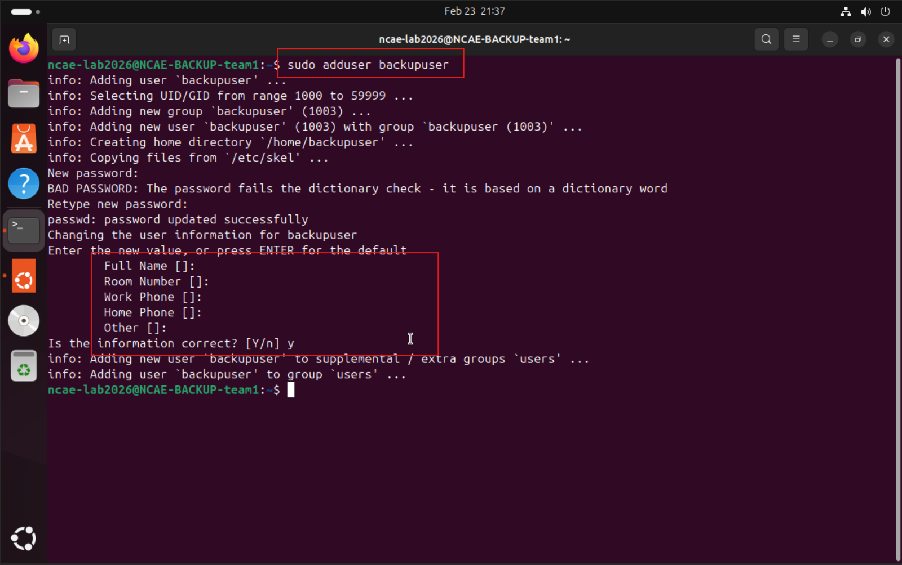

---

## 8. Install rsync (ALL Machines) - ALL MACHINES

```bash
sudo apt update
sudo apt install rsync -y
```

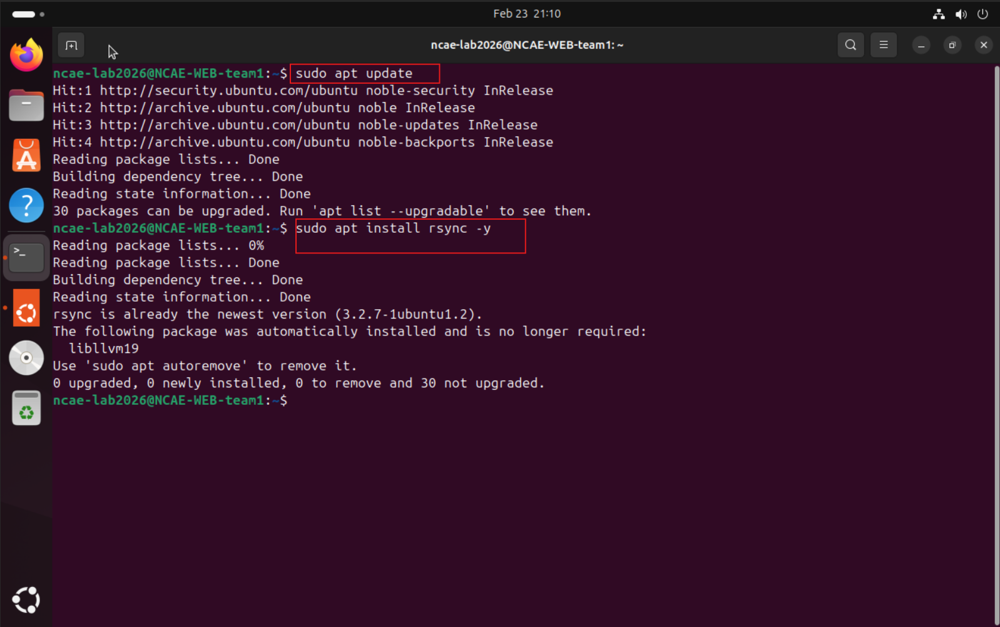

---

## 9. Generate SSH Key on Backup Server - BACKUP SERVER

```bash
sudo -i -u backupuser
ssh-keygen -t rsa -b 4096 -f /home/backupuser/.ssh/backup_pull_key
```

Press ENTER when asked for passphrase.

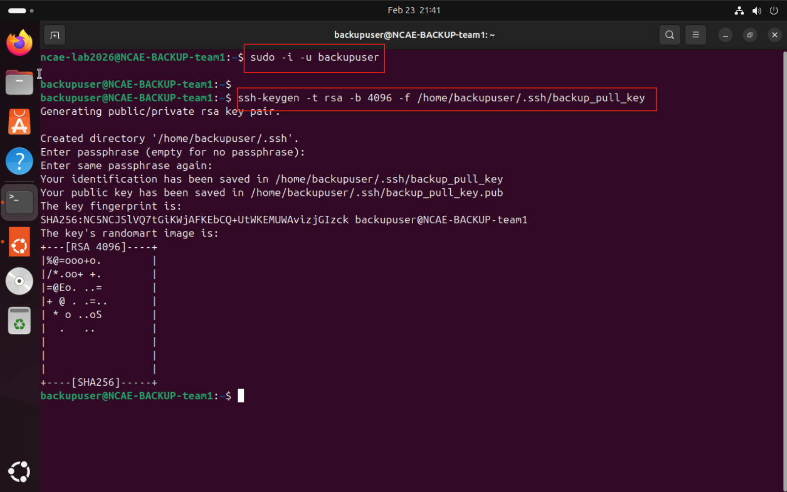

---

## 10. Copy Public Key to Each Service Machine - BACKUP SERVER

```bash
ssh-copy-id -i /home/backupuser/.ssh/backup_pull_key.pub backupuser@192.168.<t>.5
ssh-copy-id -i /home/backupuser/.ssh/backup_pull_key.pub backupuser@192.168.<t>.12
ssh-copy-id -i /home/backupuser/.ssh/backup_pull_key.pub backupuser@192.168.<t>.7
ssh-copy-id -i /home/backupuser/.ssh/backup_pull_key.pub backupuser@172.18.14.<t>
```

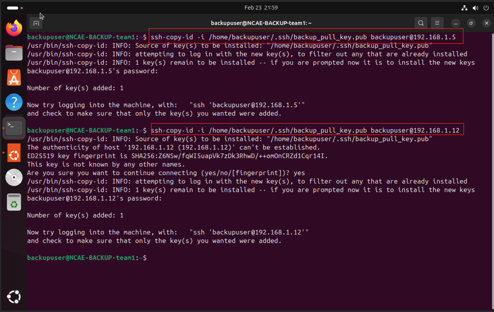
.png)
.png)

---

## 11. Verify Key Login Works - BACKUP SERVER

```bash
ssh -i /home/backupuser/.ssh/backup_pull_key backupuser@192.168.<t>.5
```

If no password prompt appears, it worked.

---

## 12. Lock Password After Verification - ALL MACHINES

```bash
sudo passwd -l backupuser
```

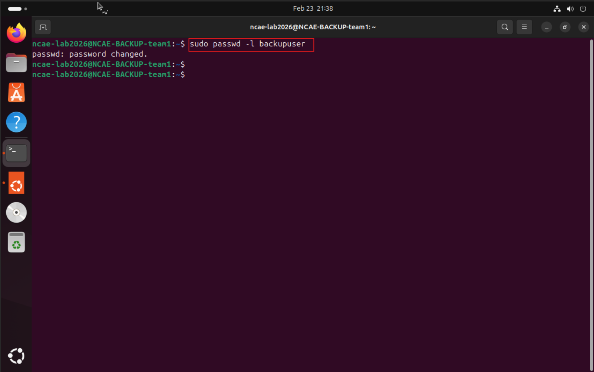

---

## 13. Create Backup Storage Structure - BACKUP SERVER

```bash
sudo mkdir -p /backups/web
sudo mkdir -p /backups/dns
sudo mkdir -p /backups/db
sudo mkdir -p /backups/smb
sudo chown -R backupuser:backupuser /backups
```

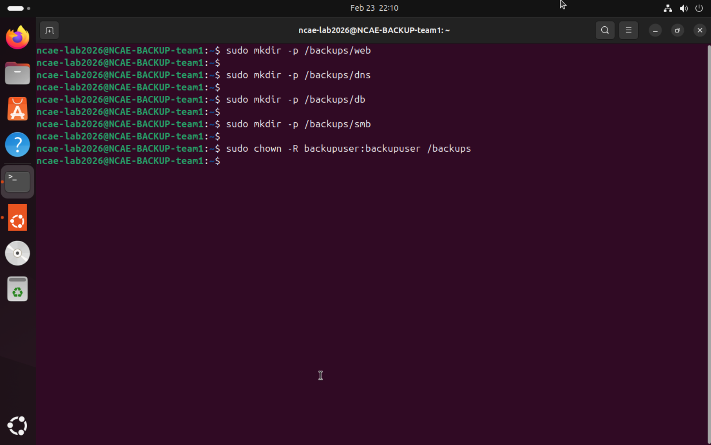

---

## 14. Pull Web Files - BACKUP SERVER

```bash
rsync -avz -e "ssh -i /home/backupuser/.ssh/backup_pull_key" backupuser@192.168.<t>.5:/var/www/html/ /backups/web/
```

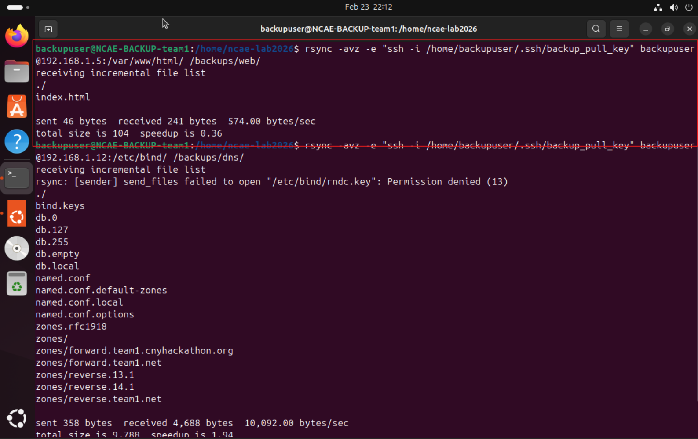

---

## 15. Pull DNS Configuration - BACKUP SERVER

```bash
rsync -avz -e "ssh -i /home/backupuser/.ssh/backup_pull_key" backupuser@192.168.<t>.12:/etc/bind/ /backups/dns/
```

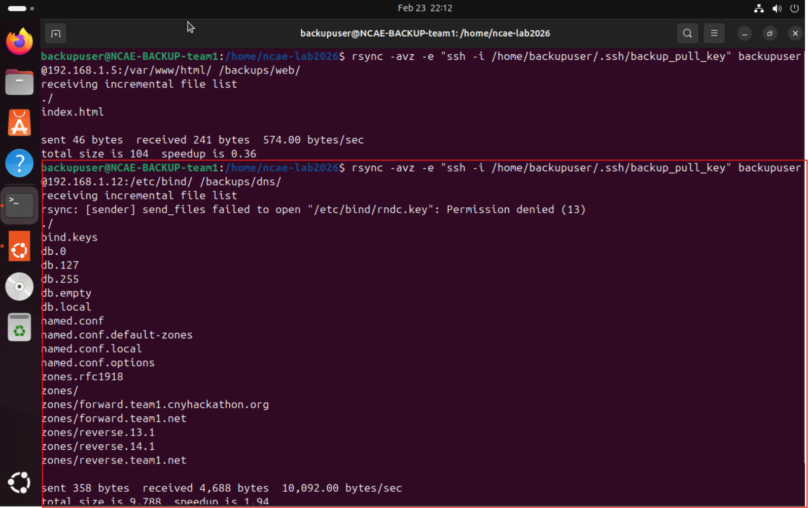

---

## 16. Pull Database Dump - DATABASE SERVER (Dump) + BACKUP SERVER (Pull)

```bash
sudo -u postgres pg_dump db > /backup/db_backup.sql
```

Then:

```bash
rsync -avz -e "ssh -i /home/backupuser/.ssh/backup_pull_key" backupuser@192.168.<t>.7:/backup/db_backup.sql /backups/db/
```

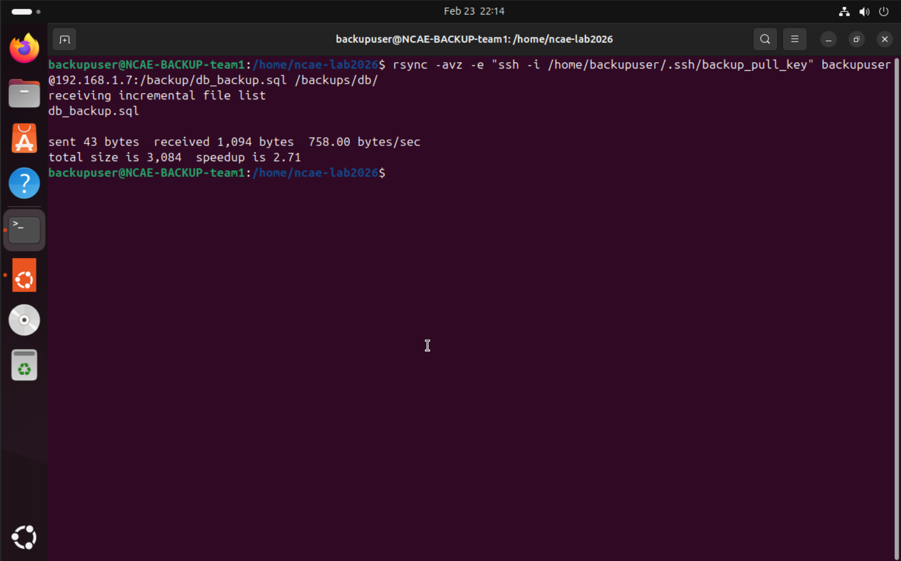

---

## 17. Pull SMB Artifacts - BACKUP SERVER

```bash
rsync -avz -e "ssh -i /home/backupuser/.ssh/backup_pull_key" backupuser@172.18.14.<t>:/mnt/files/ /backups/smb/
```

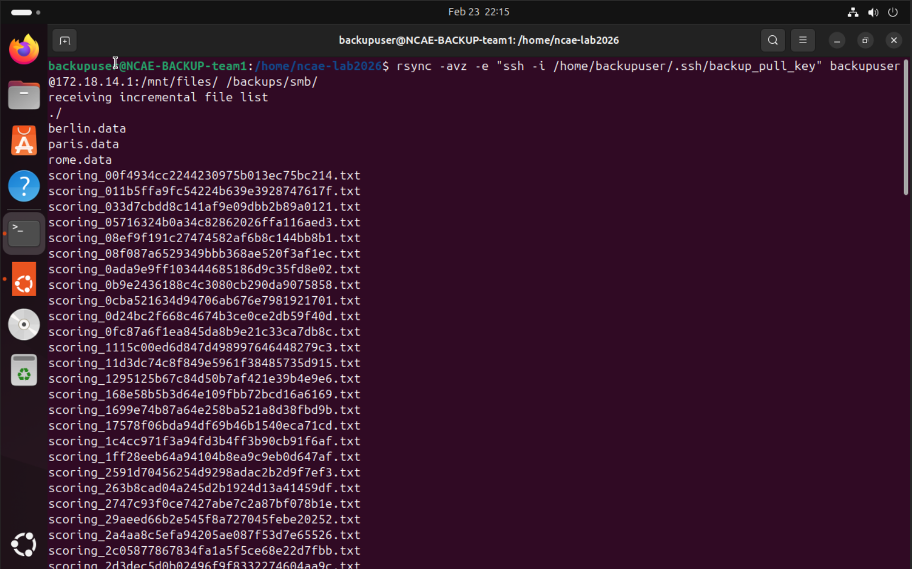

---

---

# Part 4 – Manual Service Recovery

All restore operations begin from the backup server:

`192.168.<t>.15`

Login as:

```
backupuser
```

Use the private key:

```
/home/backupuser/.ssh/backup_pull_key
```

---

## Web Recovery 

### From Backup Server

```bash
rsync -avz -e "ssh -i /home/backupuser/.ssh/backup_pull_key" \
/backups/web/ backupuser@192.168.<t>.5:/tmp/web_restore/
```

### On Web Server

```bash
sudo rsync -av /tmp/web_restore/ /var/www/html/
sudo systemctl restart apache2
```

Verify:

```bash
curl http://localhost
```

---

## DNS Recovery

### From Backup Server

```bash
rsync -avz -e "ssh -i /home/backupuser/.ssh/backup_pull_key" \
/backups/dns/ backupuser@192.168.<t>.12:/tmp/dns_restore/
```

### On DNS Server

```bash
sudo rsync -av /tmp/dns_restore/ /etc/bind/
sudo systemctl restart bind9
```

Optional validation:

```bash
sudo named-checkconf
```

---

## PostgreSQL Recovery

### From Backup Server

```bash
rsync -avz -e "ssh -i /home/backupuser/.ssh/backup_pull_key" \
/backups/db/ backupuser@192.168.<t>.7:/tmp/db_restore/
```

### On Database Server

If the database does not exist:

```bash
sudo -u postgres createdb db
```

Restore:

```bash
sudo -u postgres psql db < /tmp/db_restore/db_backup.sql
sudo systemctl restart postgresql
```

Verify:

```bash
sudo -u postgres psql -c "\l"
```

---

## SMB Recovery

### From Backup Server

```bash
rsync -avz -e "ssh -i /home/backupuser/.ssh/backup_pull_key" \
/backups/smb/ backupuser@172.18.14.<t>:/tmp/smb_restore/
```

### On SMB Server

```bash
sudo rsync -av /tmp/smb_restore/ /mnt/files/
sudo systemctl restart smbd
```

Verify:

```bash
ls /mnt/files/
```

---

## SSH Recovery

### From Backup Server

```bash
rsync -avz -e "ssh -i /home/backupuser/.ssh/backup_pull_key" \
/backups/ssh_backup/ backupuser@192.168.<t>.5:/tmp/ssh_restore/
```

### On Target Server

```bash
sudo rsync -av /tmp/ssh_restore/ /home/
sudo systemctl restart ssh
```

Verify key-based login works.

---

# Part 5 – Automate Pull Backups

On `192.168.<t>.15` as backupuser:

```bash
crontab -e
```

Add:

```
*/5 * * * * rsync -az -e "ssh -i /home/backupuser/.ssh/backup_pull_key" backupuser@192.168.<t>.5:/var/www/html/ /backups/web/
*/5 * * * * rsync -az -e "ssh -i /home/backupuser/.ssh/backup_pull_key" backupuser@192.168.<t>.12:/etc/bind/ /backups/dns/
*/5 * * * * rsync -az -e "ssh -i /home/backupuser/.ssh/backup_pull_key" backupuser@192.168.<t>.7:/backup/db_backup.sql /backups/db/
*/5 * * * * rsync -az -e "ssh -i /home/backupuser/.ssh/backup_pull_key" backupuser@172.18.14.<t>:/mnt/files/ /backups/smb/
```

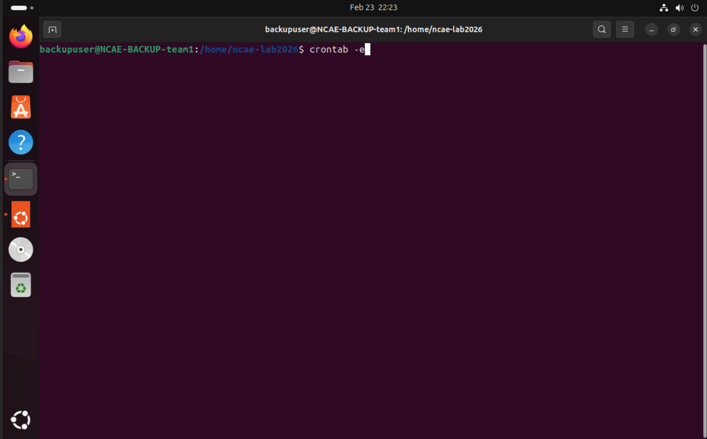

---

# Final Note

A service can be running and still be failing.

A port can be open and still be failing.

Scoring checks correctness, not just uptime.

If attackers delete:

- berlin.data  
- zone files  
- pg_hba.conf  
- authorized_keys  
- index.html  

Your system must recover quickly.

Backups are not optional.

They are part of defensive architecture.

Recovery speed wins competitions.